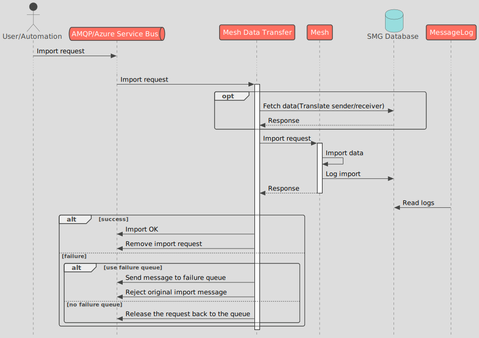

## General info

`Mesh Data Transfer` solution enables users to perform time series and availability data exports and imports from a `Mesh` server. It uses AMQP protocol as an external communication method to guarantee high level of reliability and versatility. 
`Mesh Data Transfer` consists of four services - `Trigger Relay`, `Mesh Amqp Relay`, `Export Data Store` and `Database Gateway`. These services are provided as a separate installer/zip package.

### Trigger Relay

`Trigger Relay` is an entry point for export orders sent from certain Volue products (eg. Participant, Nimbus). It offers HTTP endpoints for creating both availability and time series export orders.

### Mesh Amqp Relay

`Mesh Amqp Relay` receives export and import orders from configured queues. It is responsible for communicating with `Mesh` server and then sending outcome of that communication to AMQP reply queues and/or `Export Data Store`.

### Export Data Store

`Export Data Store` stores data received from `Mesh Amqp Relay`/`Trigger Relay` via HTTP endpoint. This data can be stored either as a file on a configured disk location or sent to the AMQP queue. This service is also responsible for saving export status to the `Message Log` and determining final outcome of the export operation. 

### Database Gateway

`Database Gateway` is responsible for database communication. It provides HTTP endpoints for other services to invoke predefined SQL queries. For more details see the [DatabaseGateway README](./src/DatabaseGateway/README.md).

## Usage

### Time series export

To invoke a Mesh time series export one has to post a HTTP request to `Trigger Relay`'s `Order` service. Minimal working example:

```powershell
curl.exe -s http://localhost:7000/Order -H "Content-Type: application/json" -d '[{"Date":"2024-10-11T17:10:37","Receiver":"DemoBase","Keytab":1,"ValuesFrom":"2024-05-09T00:00:00","ValuesTo":"2024-05-11T00:00:00","Protocol":126}]'.replace('"', '\"')
```

A prerequisite of a successful time series export is a pre-filled `keytab9` database table with references to the time series we want to export. The `keytab` parameter refers to the taret `keytab9` row. `keytab9` is normally filled by the client application like Participant or Nimbus.

`Protocol` denotes the export type. Possible options are:

| ID  | Protocol        |
| --- | --------------- |
| 121 | PVPLAN          |
| 122 | Bidding         |
| 123 | Standard export |
| 125 | APOR/APOT       |
| 134 | GS2             |
| 135 | EDIEL DELFOR    |
| 137 | Excel CSV       |


`Receiver` can be either the name or the integer key (`opun_key`) of the receiver participant.

#### Export sender

The sender defined in the time series export definition (a "sender host") is used by Mesh Data Transfer to specify the sender of the time series data (the sender is then referenced in the Message Log or directly in case of some of the export types, like Standard export or GS2; moreover all the output is grouped by the senders (see below)). If the sender is not defined in the time series export definition, a default sender is selected (which is defined by `ParticipantSettings/ICC_SENDER` parameter in `Trigger Relay` configuration).

There is also an option to specify the sender in the time series export request:

```powershell
curl.exe -s http://localhost:7000/Order -H "Content-Type: application/json" -d '[{"Date":"2024-10-11T17:10:37","Receiver":"DemoBase","Sender":"Mesh",Keytab":1,"ValuesFrom":"2024-05-09T00:00:00","ValuesTo":"2024-05-11T00:00:00","Protocol":126}]'.replace('"', '\"')
```

In this case the exported time series will be limited to those that match the input sender parameter. When the time series export definition does not specify the sender host, it will be replaced with the input sender parameter (instead of the default sender).

The same rules apply to Sender request parameter as to the Receiver parameter, i.e. it can be a name or an integer.

##### Grouping of the output by sender

If the time series included in a single time series export request refer to a different sender, these time series will be grouped into separate export results.

## Data Flow

Message flow when _importing_ data to `Mesh`:



Message flow when _exporting_ data from `Mesh`:


`Trigger Relay` provides request tracking capability. A request ID is included in the response to the export request. It can be used to check the request status by sending `HTTP` `GET` to the `Trigger Relay`'s `exportstatus/<ID>` endpoint. Example:

```powershell
curl.exe -s http://localhost:7000/exportstatus/4bb1306d-5259-411a-8e28-2c41107d48c9
```

The Data Transfer services still support a legacy export flow, which involves `Mesh AMQP Relay` service and depends on an `AMQP` broker. In the legacy export flow, the request tracking capability is __not__ present.
Message flow when _exporting_ data from `Mesh` with legacy export flow enabled:


