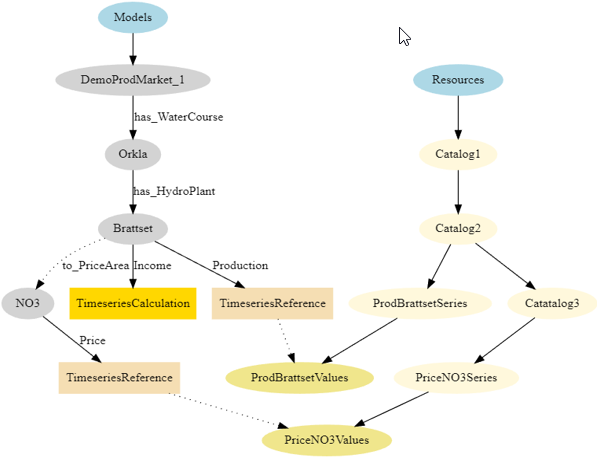
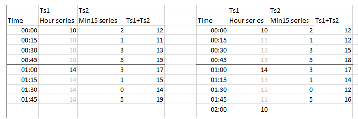

# Calculations in Mesh - general concepts

This is an important and unique part of Mesh. It gives Volue and its customers
the ability to define time series as expressions, rather than having a separate
calculation carried out and let values be stored onto a time series then
available for read. Many years ago Volue introduced the concept of virtual time
series, which means the calculation is integrated as part of the read operation.


## Calculation expression language

The expression language has a proprietary syntax. It has been around since mid
90's and is widely adopted by the Volue customers to extend their collection of
available time series. Some characteristics on the language:

- The expressions are vector based eliminating the need for complicated loops.
- References to time series are done by the Mesh search and the navigation
  language. See example.
- Standard operators and operator precedence are supported (+,-,*,/).
- There are built-in functions covering a wide range of operations.


### Example 1

Assuming we have an expression on a Mesh object type *HydroPlant* that is
bound to a time series attribute definition *Income*. On the *HydroPlant* type
there is another time series attribute definition *Production* as well as a
time dependent relation *to_PriceArea* to a *PriceArea* type object. On the
*PriceArea* object type there is a time series attribute definition *Price*.


The calculation of *Income* can be expressed like this:

```
## = @t('.Production') * @t('to_PriceArea.Price')
```

Some details about this simple expression:

- We have two time series that are multiplied with each other to produce the
  result, here identified by the macro `##`.

- In this example a reference function `@t(searchSpec)` is used. It is a function
  that returns the time series it finds by applying the search specification. The
  search specification has the "current instance", in this case an instance of the
  type *HydroPlant*, as its starting point. See the figure below showing a small
  physical model.

- In a search specification the dot (.) indicates local to the current object.
  Therefore '.Production' means a local attribute named Production. The search
  specification 'to_PriceArea.Price' means to navigate through a named relation
  (to_PriceArea) and then on the target object lookup the local attribute named
  Price.



When values for a given time interval are requested for the Income series on a
model object Brattset, a HydroPlant instance, the search and navigation will see
the world from this instance. Navigating to_PriceArea in this case ends up in
the PriceArea instance named NO3.


## Functions

Here are some general comments to functions used in expressions:

A function is defined as `@function_name(arguments)`. The arguments may be empty
or defined as a comma separated list.

Mesh calculation supports six basic data types. This is:

- A number - represented by letter `d`
- A string - represented by letter `s`
- A time series - represented by letter `t`
- A vector of numbers - represented by letter `D`
- A vector of strings - represented by letter `S`
- A vector of time series - represented by letter `T`

All functions are registered with an argument list definition and a return value
type. For instance, the function t used in the example above has a signature
`@t(s) -> t`. A signature suffix `ttsd` means 4 arguments: a time series, a time
series, a string and a number.

Another example: A function named SUM has multiple signatures: `@SUM(T) -> t`,
`@SUM(t) -> d` and `@SUM(D) -> d`. The first version takes a vector of time
series and returns the sum of these time series, the second version takes a time
series and returns a number and the last version takes a vector of numbers and
returns a single number.

A function implementation will normally have to cope with the fact that time
series given as arguments may have different resolutions. Ref. example above:
the Production series may have values every 15 minutes and the Price series may
have values every hour.

The argument to a function can be the result of another function.


## Calculation expression definition

The time series calculation definitions are in general associated with the
Mesh model definition. This means that the calculations are defined as part
of the domain description and expressed using types and attributes therein.
Traditionally, before Mesh, expressions referred to explicit time series and in
consequence they were less generic than Mesh based expressions. Mesh and mesh
information modelling have created the foundation for generalized expressions,
template calculation expressions.

In cases where the general template based calculation expression definition
does not "fit" very well it is possible to associate an override expression
directly onto a time series attribute on an instance in the model. This gives
a 1:1 definition which must be maintained separately, therefore should be used
with caution.


## Calculation scope with respect to time

The Mesh time series calculation definitions normally do not contain anything
about which time period or time interval to apply. This is something that is
defined as part of the read request, i.e. asking the time series to provide
values for a given time interval. A time series result is provided by addressing
a time series attribute on a Mesh instance, for instance the *Income* attribute
on a *HydroPlant* instance (ref. previous example), and give it a time interval
to get values for (the _requested interval_).

Usually, all the values are calculated on the requested interval. But
there might be functions that will need other data input. Examples:

1. `@DELTA(@t('.Temperature'))`
2. `@TS_GLIDING_AVERAGE(@t('.Temperature'), 7)`
3. `@ACCUMULATE(@t('.Precipitation'), 'YEAR')`
4. `@TS_OFFSET(@t('.Temperature'), 'DAY', 1)`

The need for extra data on these examples are commented below. Time interval is
indicated by a line where equal sign is part of the requested interval, and dots
indicate extra data needed.


### First example

`@DELTA(@t('.Temperature'))`: Delta operation needs previous value, hence one
extra value (represented by a dot) at the beginning of requested interval.

```
      .====================
```


### Second example

`@TS_GLIDING_AVERAGE(@t('.Temperature'), 7)`: A time series gliding operation
will use a value window to produce a center value. Hence it will need some extra
data at the front and at the end to produce a consistent result. When the value
is 7 this means 3 values in the front and 3 values at the end.

```
    ...====================...
```


### Third example

`@ACCUMULATE(@t('.Precipitation'), 'YEAR')`: A time series accumulate operation
will need the data from a defined start, here start of year.

```
..............//........====================
```

The // indicates that this might be many dots, depending on the start of the
requested interval.


### Fourth example

`@TS_OFFSET(@t('.Temperature'), 'DAY', 1)`: The function TS_OFFSET moves values
from one time interval to another. In this example, the values are moved one
day, i.e to the next day relative to the requested time interval.

```
    ......============
```

Here the dots represent 1 day and the requested time interval 2 days.


## Time Zones

There are situations where other time zones are involved:

- Volue database, currently the owner of the time series data in Volue context,
  is using a concept of a database zone. In our European context this is UTC+1.

- Default time zone in calculation context is, due to backwards compatibility, the
  same as DB zone - UTC+1.

- Some calculation operations are explicitly related to time zones. For example,
  a transformation of a time series from higher resolution to lower resolution
  often needs to have a definition of the zone. A fixed interval hour series
  transformed to a day series needs to know which zone this day is related to. See
  discussion of a @TRANSFORM example below.

- In some cases, the function arguments are time point macros, they will also
  need a time zone context to have a precise meaning. See the separate chapter on
  time macros.


### Using `@TRANSFORM` calculation functions

This function comes in many different variants defined by the different argument
signatures. Here, two of them are discussed:

```
## = @TRANSFORM(@t('.Consumption'), 'DAY', 'SUM')
## = @TRANSFORM(@t('.Consumption'), 'DAY', 'SUM', 'LT')
## = @TRANSFORM(@t('.Consumption'), 'DAY', 'SUM', 'UTC')
```

All examples transform an input series from its source resolution, for example
hour resolution, into a day resolution result series. Because the functions are
using DB zone (UTC+1) as a basic zone (without DaylightSavingTime (DST)) the
first result will contain values created from all hours in the UTC+1 day and
night. The second example will do the same, but will use zone UTC+1 with DST as
its definition. This means most values come from 24 source values but could also
be based on 23 or 25 values due to DST season shift.

The last example is referring to the UTC zone with no DST so values are shifted
one hour compared to the first two examples.


### Time point macros

A time point specification can be explicit or based on the macros that make time
point follow current time. Examples related to current time:

- 202002291336 -> Saturday 29 February 2020 13:36:00
- DAY - Start of the current day in UTC+1 zone
- WEEK+2d+14h-10x - Is interpreted as start of this week (UTC+1) plus 2 days
  plus 14 hours minus 10 minutes

Available base codes are YEAR, MONTH, WEEK, DAY, MIN15 and NOW. The function
named @TIME_MASK is having some examples where the mask values are created from
such macros. See the reference documentation for details.


# Basic time series operations

Calculation functions and operator implementations must be able to cope with
different time resolutions. In some cases there are functional requirements with
regards to the time series arguments given to the function, but in general not.

To cope with different resolutions, we operate with something called a
functional value. It is basically a value from the time series outside the
concrete points on the series.


## Example 1, add an 15 minute series and an hour series

The first example shows the result of adding two time series, one with hour
resolution and one with 15 minutes resolution. The light grey values on Ts1
are the "functional value" of this series on the time points not found on the
time series. As we see, the understanding of a functional value is different
whether the shape of series is defined to be stepwise or linear. The result of
this addition will have a 15 minutes resolution and if one of the operands are
linear, the result will also be defined as linear.




## Example 2, applying the MAX function on two time series arguments

The second example contains two input time series and a result time series.
The first series is a fixed resolution series of linear shape and the second
is a breakpoint time series with a stepwise shape. The function applied (@MAX)
is taking two arguments so the signature is "MAX|tt". To make the result more
"outstanding" a constant value 2 is added to the result. PS! The result curve
is added manually so it is probably not perfectly shaped, but good enough to see
how the result is created from time points coming from one of the time series,
as well as new time points coming from the functional values that represents
crossing between them. These points are indicated by vertical dash-dot lines.


