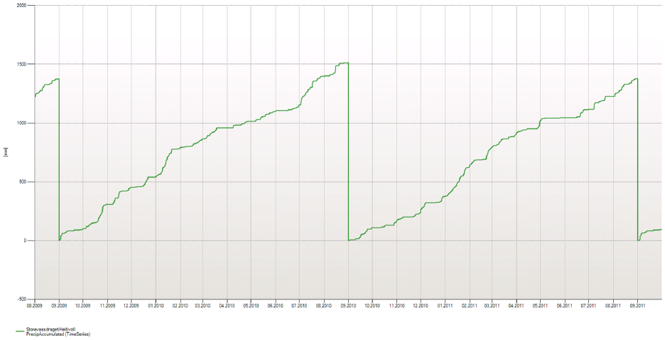

## ACCUMULATE
Accumulates values for some periods for a time series. When entering a new sub
period, the accumulation buffer is reset.

  Syntax 1

- ACCUMULATE(d,s,t[,d,d])


**Description**


| # | Type | Description |
|---|---|---|
| 1 | d | Initial value |
| 2 | s | Start time specification. May be a macro definition or a fully specified time point on the YYYYMMDDhhmmssxxx format. A calendar name may be used as prefix on this specification. Default is current standard time (utc+1 in Norwegian setup). |
| 3 | t | Input data series (fixed interval). |
| 4 | d | Multiplication factor A. If omitted, value is 1.0. |
| 5 | d | Offset factor B. If omitted, value is 0. |


  Syntax 2

- ACCUMULATE(t,[s],s)


**Description**

| # | Type | Description |
|---|---|---|
| 1 | t | Input time series (fixed interval). |
| 2 | s | Optional. Accumulation from start or end of the interval given in the next argument. ’>’ means from the start of the interval and forward. |
| 3 | s | Accumulation interval. Eg. ‘DAY’, ‘WEEK’, ‘MONTH, ‘YEAR’. You can set accumulation period to HYDYEAR, i.e. from 1. September until next 1. September (standard calendar). You can also use a prefix to overrule the standard time (utc+1 in Norwegian setup). Eg. ‘UTCWEEK’. |


Example 1 - accumulation syntax1

`@ACCUMULATE(0.0, 'UTC20140101', @t('TsAccInput'), 1.0, 0.0)`

The example starts accumulation at 1. January (UTC calendar) with initial value
0.0 and value at next time point t is

0.0 + 1.0 * TsAccInput[t] + 0.0

or

Result[t] = initialValue + Factor A * TsAccInput[t] + Factor B

for the first value and

Result[t] = Result[t-1] + Factor A * TsAccInput[t] + Factor B

for the next values.

Example 2 - accumulation syntax1

`@ACCUMULATE(0.0, 'YEAR+10d', @t('TsAccInput'))`

The example starts accumulation 10th of January (UTC calendar) with initial
value 0.0. No multiplication or offset factors are used.

Example 3 - accumulation syntax2

`## = @ACCUMULATE(@t('Precipitation_hour_operative'),'>', 'HYDYEAR')`

Accumulates the precipitation for each hydrological year.



Example 4 - accumulation syntax2

`## = @ACCUMULATE(@t('Precipitation_hour_operative'),'WEEK')`

Accumulates the precipitation for each week.


Example 5 - accumulation of bucket precipitation using explicit extended periods

The following example is a general expression for a year's accumulation of
precipitation combined with the [Time](../functions/time.md) function and extended
period functions:

```
  tstart = @Time('YEAR',@Time('SOP'))
  viewEndTime = @Time('EOP')
  @PushExtPeriod('x', tstart - @TimeSpan('HOUR'), viewEndTime)
  Precip = @t('PrecipBucket') * 1.0
  @PopExtPeriod('x')

  @PushExtPeriod('y', tstart, @Time('EOP'))
  Delta = @DELTA(Precip)
  DeltaClipped = Delta >= -2 ? Delta : 0
  @PopExtPeriod('y')
  ## = @ACCUMULATE(DeltaClipped, '>','YEAR')
```

In the following example from Nimbus, the function has accumulated the
precipitation from the turn of the year. The start value (tstart), >0, is
displayed in the blue curve:

  


In the following example from Nimbus, the presentation starts later in the year
than in the previous example. The start value (tsstar) is displayed in the blue
chart:

  


  Description of the expressions in this example:


| Expression | Description |
|---|---|
| tstart = @Time('YEAR',@Time('SOP')) | Finds the start time for the chart presentation. This example uses the YEAR macro (the start of the year), combined with a reference time indicating the report start. If the reference time is not included, the report displays the current year. See also description of the Time function. |
| viewEndTime = @Time('EOP') | The end time for the report. |
| @PushExtPeriod('x', tstart - @TimeSpan('HOUR'), viewEndTime) Precip = @t('PrecipBucket') * 1.0 @PopExtPeriod('x') | Extend relevant calculation period with one hour before the relevant start year. This example shows a linear time arithmetic by using tstart with the length of an hour in internal time format. This gives necessary data to the DELTA function in the next block. Note! This example only gives a dummy calculation (multiplied with 1), but in reality you would calculate with MIX, validate and correct functions. |
| @PushExtPeriod('y', tstart, @Time('EOP')) Delta = @DELTA(Precip) DeltaClipped = Delta >= -2 ? Delta : 0 @PopExtPeriod('y') | Runs DELTA and removes large negative contributions on the required period. |
| ## = @ACCUMULATE(DeltaClipped,'>', 'YEAR') | Calculates the result. |


  **Syntax 3**

- ACCUMULATE(t,s,d)


## Description


| Type | Description |
|---|---|
| t | Input data series (fixed interval). |
| s | Accumulation from start or end of the interval given in the next argument. ’>’ means from the start of the interval and forward. ’<’ means from the end of the interval and backwards. |
| d | Accumulation period given as number of points. |
