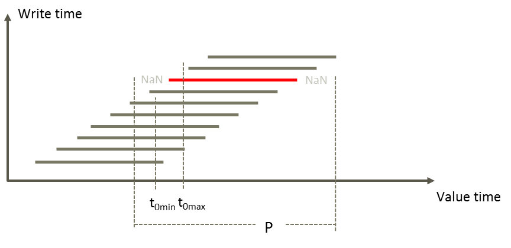

# GetForecast

**Description** GetForecast(t,d|s,d|s[,d|s])

| # | Type | Description |
|---|---|---|
| 1 | t | Time series reference identifying a forecast set. |
| 2 | d or s | t0Min |
| 3 | d or s | t0Max |
| 4 | d or s | Optional. Condition for save time, tc |

The function uses t0Min and t0Max to find the relevant forecast instead of using
the start of the requested period. It requires that the forecast series' t0 is
less than or equal to t0Max and larger than t0Min. Argument 2 has an additional
condition that the write time for the forecast series is less than or equal to
the time the argument represents. If no forecast series has its start time
within the given interval, the function returns a time series with NaN.

