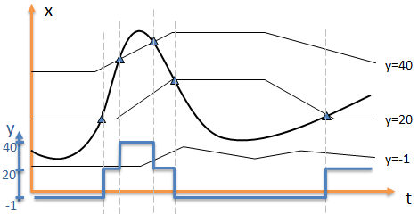

## GET_Y_FX
  **About the function**

The function looks up in an xy-relation, defined as argument to the function,
with values from a time series that also is an argument to the function. The
result is the y-value from the xy-relation, possibly interpolated. See also
information about how to handle [input values outside the provided
range](#handle-input-values-outside-the-provided-range).

## Syntax
- GET_Y_FX (t,D,D[,s])


## Description


| # | Type | ## Description |
|---|---|---|
| 1 | t | Series containing x-values used to lookup in the xy-relation to find the result value for current point of time. |
| 2 | D | X-values, sorted increasingly. |
| 3 | D | Y-values corresponding to the X-values given in the last argument. |
| 4 | s | Can have the following values: INTERPOL - means that the y-value is interpolated, default is no interpolation NOHOLD - means that if you have a NaN on the X-series, the last calculated Y-value is not used. In default mode last calculated value is used. You may combine these two methods and separate them by using a comma. |


  GET_Y_FX (t,D,D,[s]) corresponds to y=f(x)

## Example
Example 1: GET_Y_FX (t,D,D,[s])

```
R1 = @GET_Y_FX(%'/X series',{-1,20,40}, {1,2,3} )
R2 = @GET_Y_FX(%'/X series',{-1,20,40}, {1,2,3}, 'INTERPOL')
R3 = @GET_Y_FX(%'/X series',{-1,20,40}, {1,2,3}, 'INTERPOL,NOHOLD' )
```
This gives the following values for an X-series presented in the first column.


The function is best explained by an illustration:



You state a curve band, iso curves in the form of an array of time series. These
are associated with an array of y-values. In the above illustration the y-values
are -1, 20 and 40, and time series 1 is associated with value -1, time series 2
with 20 and time series 3 with 40. The thickest black curve represents values on
the input data series. In the points where this crosses the iso curves, a new
result value is generated, as the blue curve shows.


### Handle input values outside the provided range

When an input is lower than the first value from the x range provided in the
function call (-1 in the example below) the first value from the y range will be
returned (1 in the example below).

When an input is higher than the last value from the x range provided in the
function call (40 in the example below) the last value from the y range will be
returned (3 in the example below).

**Example**

```
##=@GET_Y_FX(@t('t'), {-1,20,40}, {1,2,3}, 'INTERPOL,NOHOLD')
```


| input | output |
|---|---|
| -10 | 1 |
| 2 | 1.142 |
| 10 | 1.523 |
| NaN | NaN |
| 30 | 2.5 |
| NaN | NaN |
| 50 | 3 |


  ****
