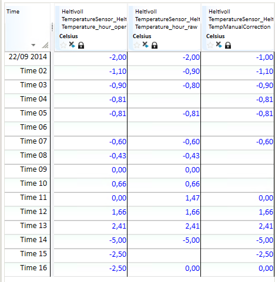

## MIN
## About the function
Finds the highest values in time series, numbers, arrays or combinations of
these. The result series has the same resolution as the input time series.

## Syntax
- MIN(T)
- MIN(D)
- MIN(t)
- MIN(t,t)
- MIN(T,t)
- MIN(t,T)
- MIN(t,d)
- MIN(d,t)
- MIN(d,d)
- MIN(T,T)

## Description

| # | Type | Description |
|---|---|---|
| 1 | t T d D | Time series Array of time series Number Array of numbers |
| 2 | t d T | Time series Number Array of time series |

## Example
Example 1: @MIN(T)

`Temperature_hour_operative = @MIN(@T('Temperature_hour'))`

@T(‘Temperature_hour’) is an array of time series.

Returns the lowest value of all the time series in the array for each time step,
e.g.:

Example 2: @MIN(D)

Result = @MIN({1, 5, 8, 2.5, 11})

Result = 1

Result returns the lowest value from the array of numbers.

Example 3: @MIN(t)

Returns the lowest values from the time series for the requested period.

`Temperature_hour_operative = @t('Temperature_hour_raw')/@MIN(@t('Temperature_hour_raw'))`

From the requested period, we can see that the minimum value is -5. Used in
calculation the result values are divided on -5.

`Temperature_hour_operative = @t('Temperature_hour_raw')+@MIN(@t('Temperature_hour_raw'))`

From the requested period, we can see that the minimum value is -5. Used in
calculation the result values are added by -5.

Example 4: @MIN(t,t)

`Temperature_hour_operative = @MIN(@t('Temperature_hour_raw'),@t('TempManualCorrection'))`

It returns the lowest of the values for each time step in time series 1 and time
series 2.

Example 5: @MIN(T,t)

`Temperature_hour_operative = @MIN(@T('Temperature_hour'),@t('TempManualCorrection'))`

@T('Temperature_hour') is an array of three time series.
@t('TempManualCorrection') is a single time series.

Returns the lowest value of the time series in the array and the single time
series for each time step, e.g.:

Example 6: @MIN(t,d)

`Temperature_hour_operative = @MIN(@t('Temperature_hour_raw'),-0.5)`

Returns the lowest value of the time series and a selected number for each time
step, e.g.:

Example 7: @MIN(d,d)

Res = @MIN(8,2.5)

Res = 2.5

Returns the lowest value of the two numbers.
