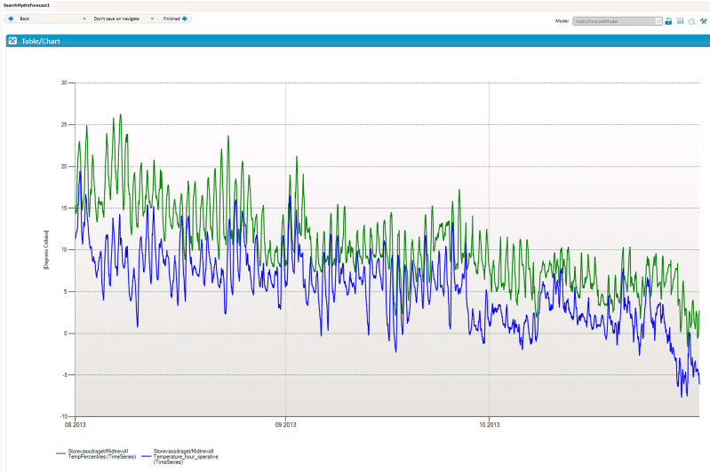
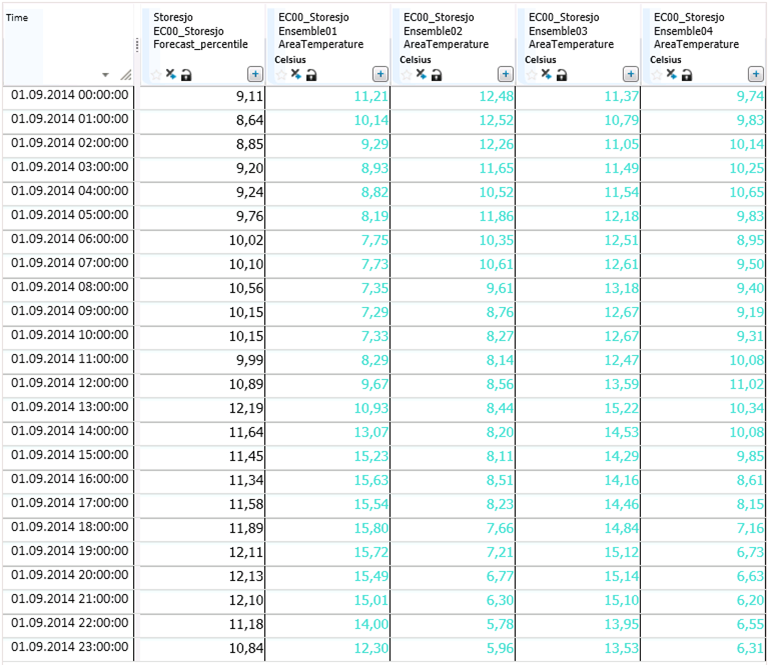

## PERCENTILE
**About the function**

Calculates percentiles based on one time series or an array of time series.

Syntax1

- PERCENTILE(t,d,d,d[,s,[,s]])

It takes one series as argument and history from year and to year as second and
third argument.

## Description

| # | Type | Description | Example |
|---|---|---|---|
| 1 | t | Source time series to create percentile from. |   |
| 2 | d | Start year | 1990 |
| 3 | d | To year | 2000 |
| 4 | d | The percentile to be calculated. | Value between 1 and 100. |
| 5 | s | Optional parameter.  Method specification. Possible values are BY_SUM, SCALED_MEAN_BY_SUM or SCALED_BY_SUM. See description below. |   |
| 6 | s | Period definition for the function.  Note! Remember + before the first element, comma as separator and period length without +. | '+3d' Three days after the end time.  '-3d' Three days before the starting time.  '+3d,5d' Three days after the starting time with a period length of five days. |

Method BY_SUM:

- Sums each single time series included in the function and finds the percentile index based on the established sums. As a consequence, this method always returns a result equal to one of the series defined in the input data with percentile index ≤ the required percentile in the function.
- The percentile index is found by sorting the sum values from lowest to highest, giving the index (100/n-1) where n is number of input time series included in the function.

Method SCALED_MEAN_BY_SUM:

- Calculates a starting point using the method BY_SUM to find the time series with the percentile index ≤ the required percentile in the function.
- Calculates the mean value for each single time series included in the function (IndexTimeSeriesMean)
- Calculates the mean of all the time series included in the function (SumMean).
- The result equals to the time series found in the BY_SUM calculation multiplied by the factor SumMean/IndexTimeSeriesMean.

Method SCALED_BY_SUM:

- Calculates the percentile index by using the method BY_SUM.
- Calculates the sum for the required percentile in the function based on the percentile index sums using standard percentile method for each time step, i.e. the percentile sum may be interpolated (Sum1).
- Calculates the required percentile value for each time step using standard percentile method. i.e. the values may be interpolated.
- Calculates the sum for the percentile time series (Sum2).
- The percentile time series is a scaled with the factor (Sum1/Sum2).

Example 1

`## = @PERCENTILE (@t('Temperature_hour_operative'),2000,2010,100)`

If the number of observations (time series) do not correspond to the required
percentile, the percentile is calculated by linearization between previous and
following percentiles.

In this example we ask for the 100% percentile. This takes the max value for
each time step for the period from year 2000 to year 2010 (the year 2010 is not
included in the calculation).

If we want to calculate the 50% percentile based on 10 years of data, we will
have the fixed percentile of P0, P10, P20, P30, P40, P50, P60, P70, P80, P90 and
P100. The result takes the P50 values for each time step from year 2000 to year
2010.

If we ask for the 75% percentile, the function interpolates between the values
for P70 and P80.

Syntax2

PERCENTILE(T,d[,s[,s]])

It takes an array of time series as an argument.

| Type | Description | Example |
|---|---|---|
| T | Array of time series to create percentile from. |   |
| d | The percentile to be calculated. | Value between 1 and 100. |
| s | Optional parameter. Method specification. Possible values are BY_SUM, SCALED_MEAN_BY_SUM or SCALED_BY_SUM. See description below. |   |
| s | Period definition for the function. Note! Remember + before the first element, comma as separator and period length without +. | '+3d' Three days after the end time. '-3d' Three days before the starting time. '+3d,5d' Three days after the starting time with a period length of five days. |

Example 2

`## = @PERCENTILE(@T('AreaTemperature'),100,'BY_SUM')`

The result will be equal to the time series with the highest sum for the
requested period, i.e. Ensemble03 (P100).

Example 3

`## = @PERCENTILE(@T('AreaTemperature'),100,'SCALED_MEAN_BY_SUM')`

The result will be equal to the time series with the highest sum for the
requested period, i.e. Ensemble03 (P100). This is scaled by the factor
SumMean/IndexTimeSeriesMean.

Example 4

`## = @PERCENTILE(@T('AreaTemperature'),100,'SCALED_BY_SUM')`

The result will be equal to the max value for each time step scaled with a
factor. The factor is found by taking the sum for the time series with
percentile index P100, divided by the sum for the max value time series.

