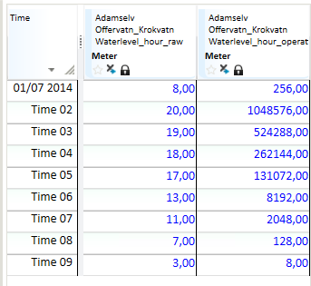

## POWER
## About the function
Returns the result of a time series or number raised to a power. The function
uses the equation `y=xn. x` and `n` can be a time series or a number.

The result series has the same resolution as the input time series.

## Syntax
- POWER(d|t,d|t)

## Description

| # | Type | Description |
|---|---|---|
| 1 | d | Numerical value used for the number x in the equation. |
| 1 | t | Time series used for the number x in the equation. |
| 2 | d | Numerical value used for the exponential factor n in the equation. |
| 2 | t | Time series used for the exponential factor n in the equation. |

## Example
Example 1: @POWER(t,d)

```
Waterlevel_hour_operative = @POWER(@t('Waterlevel_hour_raw'),2)
```


Example 2: @POWER(d,t)

```
Waterlevel_hour_operative = @POWER(2,@t('Waterlevel_hour_raw'))
```



Example 3: @POWER(t,t)

```
Waterlevel_hour_operative = @POWER(@t('Waterlevel_hour_raw'),@t('Waterlevel_hour_raw'),)
```


Example 4: @POWER(d,d)

```
RS4 = @POWER(4,2)
```

Example 4 returns the number 16 (4 to the power of 2).
