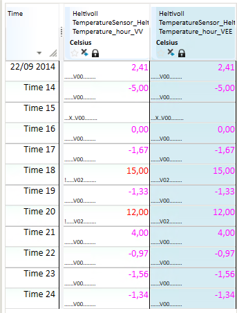

## RESET_STATUS
## About the function
This function is used to make changes on the [status of time
series](../functions/status.md). The result series has the same resolution as the input
time series.

  **Syntax**

- RESET_STATUS(t[,d|s])

## Description

| # | Type | Description |
|---|---|---|
| 1 | t | Time series. Zeroes out all status information for the time series. |
| 2 | d or s | Optional. Zeroes out all status specified in argument 2. Symbols can be combined by adding | between them, for instance: 'notok|manual|V01'. See tables below with valid arguments for status mask, validation methods and correction methods. Optional. Internal use only. Zeros selected bits based on the bit code behind every symbol. |

  Status mask (case sensitive):

| ARGUMENT | Definition |
|---|---|
| novalue | No value |
| notok | Not ok |
| suspect | Value with status supect |
| manual | Includes both manually changed and estimated values |
| MANUAL | Only manually changed |
| estimated | Only manually estimated |
| validated | Validated |
| corrected | Corrected |
| locked | Locked |
| accepted | Accepted |
| default | Default |

  Validation methods:

`V01` means validation method 1. You can see this code if you turn on value
information in Nimbus. Available validation methods are as follows:

| ARGUMENT | METHOD |
|---|---|
| V01 | Abs limit |
| V02 | Delta limit |
| V03 | Delta limit extreme |
| V04 | Repeated value |

  Correction methods:

C01 means correction method 1. You can see this code if you turn on value
information in Nimbus. Available correction methods are as follows:

| ARGUMENT | METHOD |
|---|---|
| C01 | Constant value |
| C02 | Copy value |
| C03 | Interpolate |
| C04 | Extrapolate |
| C05 | Average value |

## Example
  Example 1: @RESET_STATUS(t)

  ResultTs = @RESET_STATUS(@t(‘Ts1’))

  Zeroes out all status information for the time series.

  Example 2: @RESET_STATUS(t,s)

  Temperature_hour_VEE = @RESET_STATUS(@t('Temperature_hour_VV'),'notok')

In the following example, the first column is the series original status. In the
second column the status sign/exclamation mark,`!`(Not ok), is removed.

  
