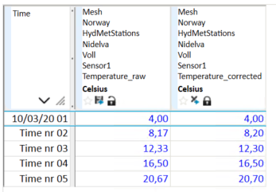

## ROUND
## About the function
Rounds the numbers of a time series. To make rounding to for instance two
decimals, you must multiply with 100, do ROUND operation and then divide by 100.

The result series has the same resolution as the time series/argument series.

The function can also be applied to a single number.

## Syntax

- ROUND(t)
- ROUND(d)

**Description**

| # | Type | Description |
|---|---|---|
| 1 | t | Time series |
| 1 | d | Number |

## Example
`Temperature corrected = @ROUND(@t('.Temperature_raw')*10)/10`

This result is rounded to one decimal.

`Temperature corrected = @ROUND(@t('.Temperature_raw'))`

This result is rounded to zero decimals.

