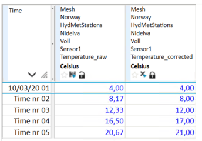

# ROUND_INTEGER
## About the function
This function rounds values in a time series to the nearest whole number.

The result series has the same resolution as the time series/argument series.

The function can also be applied to a single number.

## Syntax
- ROUND_INTEGER(t)
- ROUND_INTEGER(d)

**Description**

| # | Type | Description |
|---|---|---|
| 1 | t | Time series |
| 1 | d | Number |

## Example
`Temperature corrected = @ROUND_INTEGER(@t('.Temperature_raw'))`

