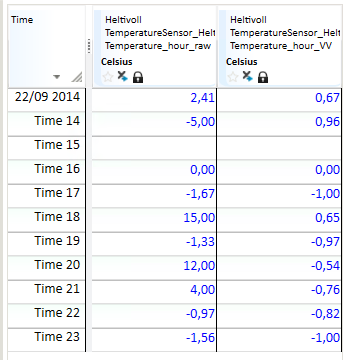

# SIN
## About the function
Calculates the sine of a time series. **Note!** The values of the input are in
radians.

## Syntax
- SIN(t)

| # | Type | Description |
|---|---|---|
| 1 | t | Time series |

## Example
`Temperature_hour_VV = @SIN(@t('Temperature_hour_raw'))`

