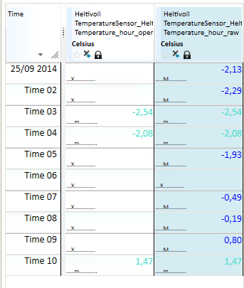

## STATUS_MASK
## About the function
Makes it possible to execute operations on time series based on the [status
code](../functions/status.md) associated with the values.

  **Syntax**

- STATUS_MASK(t,s,s)

## Description

| # | Type | Description |
|---|---|---|
| 1 | t | Time series, fixed interval or breakpoint series. |
| 2 | s | Status mask consisting of one or several symbols. Symbols can be combined by adding | between them, for instance: 'notok|manual|V01'. See tables below with valid arguments for status mask, validation methods and correction methods. |
| 3 | s | Logical argument. See table below with valid logical arguments (BOOL etc.). |

  Status mask (# 2):

  This argument is case sensitive.

| argument | Description |
|---|---|
| novalue | No value |
| notok | Not ok |
| missing | Missing value |
| suspect | Value with suspect status |
| manual | Includes both manually changed and estimated values |
| MANUAL | Only manually changed |
| estimated | Only manually estimated |
| validated | Validated |
| corrected | Corrected |
| locked | Locked |
| accepted | Accepted |
| default | Default |

  Validation methods (# 2):

`V01` means validation method 1. You can see this code if you turn on value
information in Nimbus. Available validation methods are as follows:

| ARGUMENT | Method |
|---|---|
| V01 | Abs limit |
| V02 | Delta limit |
| V03 | Delta limit extreme |
| V04 | Repeated value |

  Correction methods (# 2):

| ARGUMENT | Method |
|---|---|
| C01 | Constant value |
| C02 | Copy value |
| C03 | Interpolate |
| C04 | Extrapolate |
| C05 | Average value |

  Logical arguments (# 3):

  This argument is case insensitive

| ARGUMENT | Definition |
|---|---|
| BOOL | The result is a logical time series which returns values 0 for the status mask specified in argument 2, other statues are set to 1. |
| BOOLINV | The result is a logical time series which returns value 1 for the status mask specified in argument 2, other statuses are set to 0. |
| REMOVE | Removes all values on the time series for the status mask specified in argument 2. The result time series is always a break point series. |
| BLANK | Sets all the values, which matches the status mask specified in argument 2, to NaN. |

## Example
`Temperature_hour_operative = @STATUS_MASK(@t('Temperature_hour_raw'),'missing|MANUAL','BOOL')`

  The result sets all the missing and manually changed values to 0.

  

`Temperature_hour_operative =
@STATUS_MASK(@t('Temperature_hour_raw'),'missing|MANUAL','BOOLINV')`

  The result sets all the missing and manually changed values to 1.

  

`Temperature_hour_operative = @STATUS_MASK(@t('Temperature_hour_raw'),'MANUAL','BLANK')`

  The result sets all the manually changed values to NaN.

  
