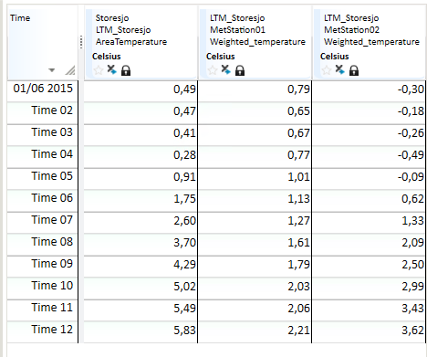

# SUM
## About the function
This function calculates the sum of all of the values of a time series, or all
of the series in an array of time series.

## Syntax
- SUM(t)
- SUM(T)

## Description

| # | Type | Description |
|---|---|---|
| 1 | t or T | Source time series to create sum from. Array of time series to create sum from. |

## Example
### Example 1: @SUM(t)

Result = @SUM(@t(’Ts1’))

The function returns the sum of the values of the time series for the required
period. It returns a number.

### Example 2: @SUM(T)

AreaTemperature = @SUM(@T('Weighted/Weighted_temperature')) sums an array of
time series.

The function returns the sum of the values of the expressions received for
processing.

The resulting time series is equal to the sum of the values for each time
interval in the expression. For instance, in the first row, the result is `0,79
+ -0,30 = 0,49` as shown in the last column.

