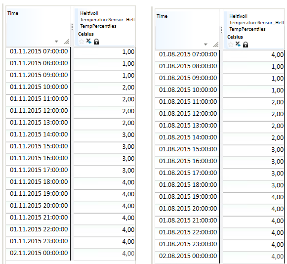

# TIME_MASK
## About the function
This function creates time series from its arguments, normally used as time
masks (a series with 1 or 0 as value), but not limited to only this type.

## Syntax
  There two main variants of this function. The general variant:

- [TIME_MASK(s,S,D,s)](#time_maskssds-and-time_maskssd)
- [TIME_MAS(s,S,D)](#time_maskssds-and-time_maskssd)
- [TIME_MASK(S,D)](#time_masksd)


  A special variant using a holiday file:

- [TIME_MASK(s)](#time_masks-and-time_maskss)
- [TIME_MASK(s,s)](#time_masks-and-time_maskss)


## TIME_MASK(s,S,D,s) and TIME_MASK(s,S,D)
The principle for the function is that you specify a repeat frequency, an array
of time points and a corresponding array of function values. The time points are
repeated at the frequency given as the first argument. The last argument allows
you to specify the resolution for the result series.


| # | Type | Description |
|---|---|---|
| 1 | s | Repeat frequency. For values, see Repeat frequency. |
| 2 | S | Time point description array in any format. See Time point description array. |
| 3 | D | Array of values which apply to the time points given in the preceding argument. |
| 4 | s | Result series resolution. For values, see Resolution. |


### Repeat frequency
This argument consists of a time span code in addition to some options. The time
span code can be one of the following calendar codes:


| Symbol | Definition |
|---|---|
| WEEKDAY | Weekdays at daytime. Gives the value 1 at time steps within 'workhours'. |
| WEEKEND | Night and weekend - the opposite of WEEKDAY for all days except WEEKEND. |
| HOLIDAY | Night, weekends and holidays - the opposite of 'NORMALDAY'. |
| NORMALDAY | Weekday at daytime, except for holidays - same as 'WEEKDAY', but holidays are excluded ('holiday' and 'mholidays'). |


  The following frequency codes can be used:


| Symbol | Definition |
|---|---|
| MIN15 | Quarter of an hour |
| HOUR | Hour |
| DAY | 24-hour period |
| WEEK | Week |
| MONTH | Month |
| YEAR | Year |
| NONE | Absolute time points, no repetition frequency |


  The options to frequency code are defined in <> brackets.


| Symbol | Definition |
|---|---|
|   | The result series gets linear curve type. |
|   | Local DST calendar used when moving time points with given frequency. |
|   | Database configured calendar used when moving time points with given frequency. |
|   | UTC calendar used when moving time points with given frequency. |


Tip! You may incorporate calendar options into frequency codes as a prefix
code. Valid calendar prefix codes are LOCAL, STANDARD, UTC and DB. For example
frequency code LOCALDAY is the same as DAY

### Time point description array
  You can use the following special codes instead of a list of definitions.


| Symbol | Definition |
|---|---|
| MONTHLY | Transformed to 12 time points representing start of each month, starting with January |
| WEEKLY | Transformed to 52 time points representing start of each week |
| DAILY | Transformed to 7 time points representing start of Monday, Tuesday etc |
| HOURLY | Transformed to 24 time points representing, from hour 0 to 23 |
| QUARTERLY | Transformed to 4 time points |


If you use one of these codes, you must still supply the correct number of
values in the next argument.

### Resolution


| Symbol | Definition |
|---|---|
| MIN15 | Quarter of an hour |
| HOUR | Hour |
| DAY | 24-hour period |
| WEEK | Week |
| MONTH | Month |
| YEAR | Year |
| VARINT | Breakpoint |


### Example
Result time series = @TIME_MASK('DAY', {'DAY+07h', 'DAY+10h', 'DAY+14h',
'DAY+18h'}, {1,2,3,4},'HOUR')

This gives a time series with daily repeat frequency and hourly time resolution.
The presentation of data values is step wise.

The table shows the result from a day on winter time (normal time). The
definition of the expression has no reference to a defined time zone and uses
the time zone of the database.

Note! If the same expressions are run for a day in summer time, the values
are shifted to one hour later.

  


Result time series = @TIME_MASK('DAY', {'DAY+07h', 'DAY+10h', 'DAY+14h',
'DAY+18h'}, {1,2,3,4},'HOUR')

This gives a time series with daily repeat frequency and hourly time resolution.
The presentation of data values is linear.

  


Result time series = @TIME_MASK('DAY', {'DAY+07h', 'DAY+10h', 'DAY+14h',
'DAY+18h'}, {1,2,3,4},'VARINT')

This gives a time series with daily repeat frequency and breakpoint time
resolution. The presentation of data values is step wise.

  

## TIME_MASK(S,D)
This syntax variant has no repeat frequency, the given points in time are
absolute. Gives the same effect as using TIME_MASK(s,S,D) with repeat frequency
'NONE'.

## TIME_MASK(s) and TIME_MASK(s,s)
These variants let you define a logical time series from criteria given in by
parameters in a text file. TIME_MASK(s) references the default calendar file
holidays.txt. TIME_MASK(s,s) uses a user-defined file. Several user-defined
files can be used in the same report. The default resolution is hours. If the
resolution is 15-minute periods (TIMESTEP {MIN 15,1}) the result series while
have this resolution.

As an example, the function can be used to find the power usage in specific
periods of the day, for instance in connection with low load, peak load etc.

### Example
  @TIME_MASK(s,s)


  The `MyHolidayfile.txt` is a user defined calendar file:
```
  # Filename: MyHolidayfile.txt

  # Tariff template: time definitions

  workhours 06:00 22:00

  weekend 6 7

  # Fixed holidays (date in American format, year/month/day)

  holiday 1/1 1/6 4/30 5/1 12/24 12/25 12/26 12/31 1997/6/20 1997/08/22

  mholiday es-3 es-2 es+1 es+39 es+40 es+50

  seasons 12/1 4/1 6/1 9/1

  lseason 4/1 11/1
```


  The function returns the following according to the calendar file definition:


| Expression | Result mask |
|---|---|
| @TIME_MASK('WEEKDAY',’MyHolidayfile.txt’) | 1 for all hours (or 15-minute periods) from 06:00 to 22:00 on all days except for weekends, i.e. Monday to Friday inclusive. 0 otherwise. |
| @TIME_MASK('WEEKEND',’MyHolidayfile.txt’) | 1 for all hours (or 15-minute periods) from 22:00 to 06:00 from Monday to Friday, and 1 for the entire day on Saturday and Sunday. 0 otherwise. |
| @TIME_MASK('HOLIDAY',’MyHolidayfile.txt’) | Same mask as for "WEEKEND", in addition to 1 for all fixed and moveable public holidays defined in the current file. See "holiday" and "mholidays". 0 otherwise. |
| @TIME_MASK('NORMALDAY',’MyHolidayfile.txt’) | Opposite of WEEKDAY. |


The result above can be illustrated in a figure showing the difference between
the various masks:

  
