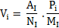
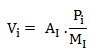

## TRANS_PROFILE
This topic describes TRANS_PROFILE variants ([R8](#r8), [Ra8](#ra8), [R9](#r9),
[Ra9](#ra9), [R10](#r10), [Ra10](#ra10), [R11](#r11), [Ra11](#ra11)) for
transforming from one time resolution to another.

To get an overview of all the transformation function variants, see:

[Transform group functions](../functions/transform.md)

### R8
## About the function
Converts a time series into a finer resolution. The function uses the SUM method
as a basis for the distribution.

## Syntax
- TRANS_PROFILE(t,t)

## Description

| TYPE | Description |
|---|---|
| t | Input time series to be converted. |
| t | Profile series stating how the values are distributed on each period connected to a value on the input data series. Gives the resolution of the result. |

The distribution of the values is done like this:

Vi = Value calculated for the time point i in the result time series

AI = Value from the input time series for the distributed period

NI = Number of valid time point to distributed the input value into

Pi = Profile value for the time point i in the result time series

MI = Calculated mean value for the profile series for the distributed period

## Example
`Profile = @TIME_MASK('HOUR',{'HOUR','HOUR+15x','HOUR+30x','HOUR+45x'},{1,2,3,2},'MIN15')`

`Result time series = @TRANS_PROFILE(@t('Ts5'),Profile)`

**Note!** This set up gives the same result as
@DISTRIBUTE(@t('Ts5'),MaskSeries,Profile) where the mask series argument is true
for all the time points.

### Ra8
## About the function
Same as [R8](#r8), but with absolute handling of the profile. The profile can be
scaled using a scaling factor, defined as first argument.

## Syntax
- TRANS_PROFILE(d,t,t)

## Description

| # | Type | Description |
|---|---|---|
| 1 | d | Scaling factor. If the scaling factor is 0, relative profiling is used, i.e. the function behaves like R8. |
| 2 | t | Input time series to be converted. |
| 3 | t | Profile series stating how the values are distributed in each period connected to a value on the input data series. Gives the resolution of the result. |

The distribution of the values is done like this:

K is a scaling factor coming from argument 1 in the function. The other symbols
used in the formula are the same as described in [R8](#r8).

Example 1

`Profile = @TIME_MASK('HOUR',{'HOUR','HOUR+15x','HOUR+30x','HOUR+45x'},{1,2,3,2},'MIN15')`

`Result time series = @TRANS_PROFILE(1,@t('Ts5'),Profile)`

**Note!** This set up gives the same result as
@DISTRIBUTE(1,@t('Ts5'),MaskSeries,Profile) where the mask series argument is
true for all the time points.

Example 2

`Profile = @TIME_MASK('HOUR',{'HOUR','HOUR+15x','HOUR+30x','HOUR+45x'},{1,2,3,2},'MIN15')`

`Result time series = @TRANS_PROFILE(10,@t('Ts5'),Profile)`

**Note!** This set up gives the same result as
@DISTRIBUTE(10,@t('Ts5'),MaskSeries,Profile) where the mask series argument is
true for all the time points.

### R9
## About the function
Same as the function [R8](#r8), but with an extra argument deciding distribution
method.

## Syntax
- TRANS_PROFILE(t,t,s)

## Description

| # | TYPE | Description |
|---|---|---|
| 1 | t | Input time series to be converted. |
| 2 | t | Profile series stating how the values are distributed on each period connected to a value on the input data series. Gives the resolution on the result. |
| 3 | s | Valid distribution methods 'MEAN', 'AVERAGE' or 'SUM'. 'SUM' gives exactly the same result as R8. |

Vi = Value calculated for the time point i in the result time series

AI = Value from the input time series for the distributed period

Pi = Profile value for the time point i in the result time series

MI = Calculated mean value for the profile series for the distributed period

If the value on the input data series is 0, the value is calculated like this:

Vi = Pi - MI

### Ra9
## About the function
Same as [R9](#r9), but with absolute handling of the profile. The profile can be
scaled using a scaling factor, defined in argument 1.

## Syntax
- TRANS_PROFILE(d,t,t,s)

## Description

| # | Type | Description |
|---|---|---|
| 1 | d | Scaling factor. If the scaling factor is 0, relative profiling is used, i.e. the function behaves like R9. |
| 2 | t | Input time series to be converted. |
| 3 | t | Profile series stating how the values are distributed on each period connected to a value on the input data series. Gives the resolution on the result. |
| 4 | s | Valid distribution methods 'MEAN', 'AVERAGE' or 'SUM'. 'SUM' gives exactly the same result as Ra8. |

The distribution of the values is done like this:

K is a scaling factor coming from argument 1 in the function. The other symbols
used in the formula are the same as described in [R9](#r9).

### R10
## About the function
Same as [R8](#r8) but uses a mask series in argument 3.

## Syntax
- TRANS_PROFILE(t,t,t)

## Description

| # | TYPE | Description |
|---|---|---|
| 1 | t | Input time series to be converted. |
| 2 | t | Profile series stating how the values are distributed on each period connected to a value on the input data series. |
| 3 | t | Mask series representing the distributed time interval. Defines the resolution of the result time series. |

The distribution of the values is done like this:

Vi = Value calculated for the time point i in the result time series

AI = Value from the input time series for the distributed period

NI = Number of valid time point to distributed the input value into

Pi = Profile value for the time point i in the result time series

MI = Calculated mean value for the profile series for the distributed period

If the value on the input data series is 0, the value is calculated like this:

Vi= Pi- MI

See also [R7](../functions/distribute.md#r7) that offers the same functionality.

### Ra10
## About the function
Same as [R10](#r10), but with absolute handling of profile. The profile can be
scaled using a scaling factor defined in argument 1.

## Syntax
- TRANS_PROFILE(d,t,t,t)

## Description

| # | Type | Description |
|---|---|---|
| 1 | d | Scaling factor. If the scaling factor is 0, relative profiling is used, i.e. the function behaves like R10. |
| 2 | t | Input time series to be converted. |
| 3 | t | Profile series stating how the values are distributed in each period connected to a value on the input data series. |
| 4 | t | Mask series representing the distributed time interval. Defines the resolution of the result time series. |

The distribution of the values is done like this:

K is a scaling factor coming from argument 1 in the function. The other symbols
used in the formula are the same as described in [R10](#r10).

### R11
## About the function
Same function as [R10](#r10), but with an extra argument deciding distribution
method. Valid values are 'MEAN', 'AVERAGE' or 'SUM'. The last value gives the
exact same result as [R10](#r10).

## Syntax
- TRANS_PROFILE(t,t,t,s)

## Description

| # | Type | Description |
|---|---|---|
| 1 | t | Input time series to be converted. |
| 2 | t | Profile series stating how the values are distributed on each period connected to a value on the input data series. |
| 3 | t | Mask series representing the distributed time interval. Defines the resolution of the result time series. |
| 4 | s | Valid distribution methods 'MEAN', 'AVERAGE' or 'SUM'. 'SUM' gives exactly the same result as R10. |

When the method is mean/average value based, the values are calculated like
this:

Vi = Value calculated for the time point i in the result time series

AI = Value from the input time series for the distributed period

Pi = Profile value for the time point i in the result time series

MI = Calculated mean value for the profile series for the distributed period

If the value on the input data series is 0, the value is calculated like this:

Vi = Pi - MI

### Ra11
## About the function
Same as [R11](#r11), but with absolute handling of profile. The profile can be
scaled using a scaling factor, defined in argument 1.

## Syntax
- TRANS_PROFILE(d,t,t,t,s)

## Description

| # | Type | Description |
|---|---|---|
| 1 | d | Scaling factor. If the scaling factor is 0, relative profiling is used, i.e. the function behaves like R10. |
| 2 | t | Input time series to be converted. |
| 3 | t | Profile series stating how the values are distributed on each period connected to a value on the input data series. |
| 4 | t | Mask series representing the distributed time interval. Defines the resolution of the result time series. |
| 5 | s | Valid distribution methods 'MEAN', 'AVERAGE' or 'SUM'. 'SUM' gives exactly the same result as R10. |

The distribution of the values is done like this:

K is a scaling factor coming from argument 1 in the function. The other symbols
used in the formula are the same as described in [R11](#r11).
