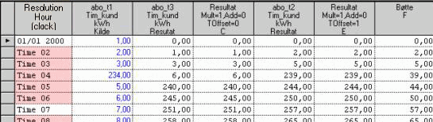

# TS_ACC_FROM
***Note!*** Although Mesh supports this function, we recommend using
[ACCUMULATE](../functions/accumulate.md) for this purpose where possible.

## About the function
Returns a new, calculated time series. The function calculates the next value
based on the previous value (running accumulation) and is used for converting
point values to accumulated values.

  The new time series has the same resolution as the input series.

## Syntax
- TS_ACC_FROM(t,t,d,d,d)


## Calculation
  yi(t)=yi-1(t)+ Axi+d-1+B

## Description


| # | Type | ## Description |
|---|---|---|
| 1 | t | Result series y. The starting value of this series remains unchanged. |
| 2 | t | Input series x. Contains values which are added to the previous value of the result series. |
| 3 | d | Linear term A. |
| 4 | d | Constant term B. |
| 5 | d | Offset d of point in time: 0: the value is retrieved from the previous time step. 1: the value is retrieved from the current time step. |


**Note!** When using Calculator, it is important that you enter this with no
assignment to the left side, as follows:

```
@TS_ACC_FROM(##,%Ts,0,1,1)
```

## Example
### Example 1: @TS_ACC_FROM(t,t,d,d,d) 
```
@TS_ACC_FROM(%'abo_t3',%'abo_t1',1,0,0)
```

Calculated with the following values: yi-1(t)=abo_t3, xi-+d-1(t) =abo_t1, A=1,
B=0. Values from the x-series is taken from the previous time step.

Result is shown in column 3 of the table. For instance, the result in row 5 is
calculated from values 234+6 i column 1 and 2, row 4.

### Example 2: @TS_ACC_FROM(t,t,d,d,d)
```
@TS_ACC_FROM>(%'abo_t2',%'abo_t1',1,0,1)
```

Calculated with the following values: yi(t)=abo_t2, xi+d-1(t) =abo_t1, A=1, B=0.
Value from the x-series is taken from the current time step.

Result is shown in column 5 of the table.


