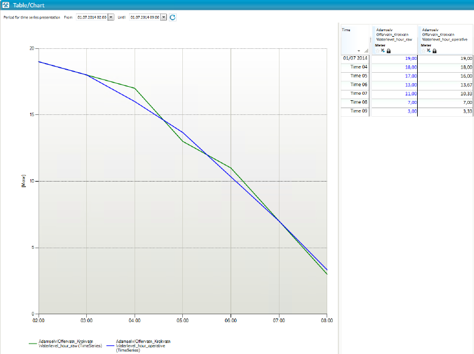

## TS_GLIDING_AVERAGE
## About the function
Smooths out major fluctuations by taking average values from surrounding values.
The amount by which the new values are smoothed out depends on the value of "d".
"d" indicates how many surrounding values should be used to produce the average
value, which means the size of the time window. If a smooth curve is required,
"d" must have a relatively high value.

## Syntax
- @TS_GLIDING_AVERAGE(t,d)

## Description

| # | Type | Description |
|---|---|---|
| 1 | t | Time series of numerical values. |
| 2 | d | Numerical value. Indicates how many surrounding values that are used to produce the average value. d must be an uneven number. |

## Example
`Waterlevel_hour_operative = @TS_GLIDING_AVERAGE (@t('Waterlevel_hour_raw'),3)`

The value for each time step using the gliding interval 3, is calculated by
summarizing the previous value, the current value and the next value, divided by
3. Se example:). Selects the time step 01.07.14 05:00:

04:00 = 18.00

05:00 = 17.00

06:00 = 13.00

Res = (18+17+13)/3 = 16

