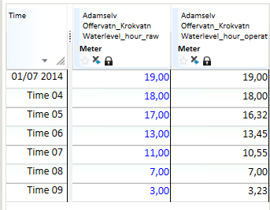

## TS_GLIDING_GAUSS
## About the function
The values of the time series are normally distributed, `d` determines the size
of the time window.

## Syntax
- @TS_GLIDING_GAUSS(t,d)

| # | Type | Description |
|---|---|---|
| 1 | t | Time series of numerical values. |
| 2 | d | Numerical value. Indicates how many surrounding values that are used to produce the average value. d must be an uneven number. |

## Example
`Waterlevel_hour_operative = @TS_GLIDING_GAUSS (@t('Waterlevel_hour_raw'),3)`

The result is a smoother time series with no major fluctuations, e.g.

