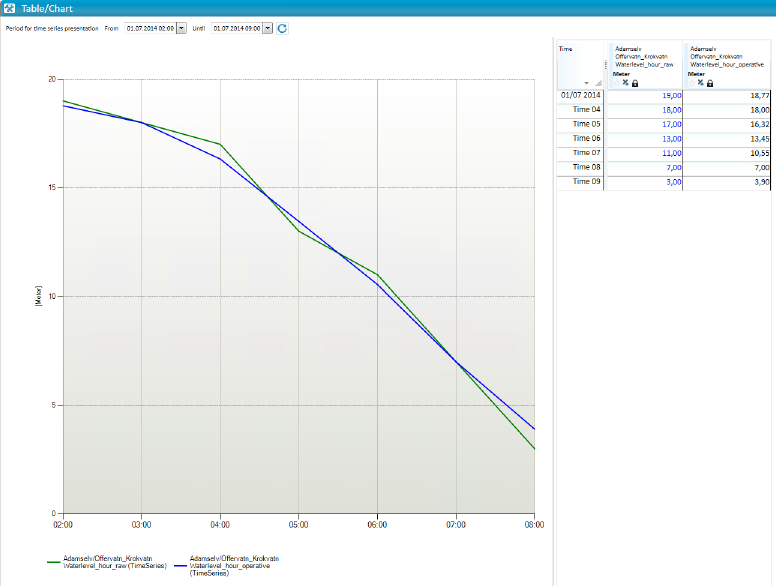

## TS_GLIDING_MEDIAN_GAUSS
## About the function
This function first calculates the median and then normally distributes the
median values. `d` determines the size of the time window.

## Syntax
- **@**TS_GLIDING_MEDIAN_GAUSS(t,d)

| # | Type | Description |
|---|---|---|
| 1 | t | Time series of numerical values. |
| 2 | d | Numerical value. Indicates how many surrounding values that are used to produce the average value. d must be an uneven number. |

## Example
`Waterlevel_hour_operative = @TS_GLIDING_MEDIAN (@t('Waterlevel_hour_raw'),3)`

With d = 3, the median is calculated with the previous value, current value and
next value and then normally distributed.

