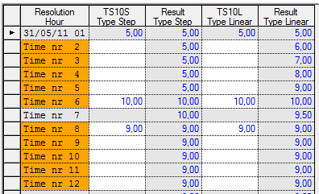

## TS_IQ-FILL
## About the function
Places logical values in any empty fields in a time series by taking the average
of the previous and following values in the time series.

The result series has the same resolution as the time series/argument series.

Values created by this function gets the status "Suspect" (S).

## Syntax
- TS_IQ_FILL(t)

## Description
The function TS_IQ_FILL considers the properties of the time series in the
argument.

Type Step: the previous value is filled in the empty cells on to the next value.

Type Linear: the value between the points in time follows linear development
from value at time [t] til time [t+1].

If the first cell(s) is empty, the next value is copied. If the last cell(s) is
empty, the previous values is copied.

## Example
Example 1: @TS_IQ_FILL(t) step

Result = @TS_IQ_FILL(%'TS10S')

Finds the first value in the first row. The value 5,00 is filled into the empty
space preceding the next value, 10,00. See table.

Example 2: @TS_IQ_FILL(t) linear

Result = @TS_IQ_FILL(%'TS10L')

The values are filled in accordance with linear development. For instance in row
2 for TS10L:

Difference between the nearest values 10,00-5,00 = 5,00

Number of steps between row 6 and row 1: 5

Increment: 5.00/5 = 1.00

New value by adding the increment: 5.00+1.00 = 6.00 in row 3. See table.

Following the last value of the series the result is equal for both editions,
the last value is kept.

