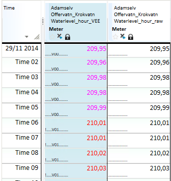

## ValidateAbsLimit
**About the function**

Validates time series using absolute limits. Values outside the specified
limits, are marked with **!** (Not Ok). Values with control towards upper or
lower limit are set to validated and marked with **V01**, meaning validation
method 1. You can see this code if you turn on value information in Nimbus.

**Syntax**

- ValidateAbsLimit(t,t|d,t|d)

## Description

| # | Type | Description |
|---|---|---|
| 1 | t | Time series to validate. |
| 2 | t d | Time series for lower limit. Numerical value for lower limit. |
| 3 | t d | Time series for upper limit. Numerical value for lower limit. |

**Example 1**
```
Waterlevel_hour_VEE = @ValidateAbsLimit(@t('Waterlevel_hour_raw'),@t('RsvLowerLimitProfile'),@t('RsvUpperLimitProfile'))
```
This example validates the input time series against lower and upper limit time
series. If the limit time series have a repetitive frequency, you can use the
[PROFILE](../functions/profile.md) function to repeat values from a given period and
resolution.

**Example 2**

`RsvLowerLimitProfile = @PROFILE(@t('RsvLowerLimit'),'YEAR')`

`@t('RsvLowerLimit')` is a breakpoint time series with monthly values.

You can also use a vector of numbers and use the [TIME_MASK](../functions/time_mask.md)
function to place the values right in time.

Example 3
```
LowerLimit = @TIME_MASK('YEAR',{'YEAR','YEAR+1m','YEAR+2m','YEAR+3m','YEAR+4m','YEAR+5m','YEAR+6m','YEAR+7m','YEAR+8m','YEAR+9m','YEAR+10m','YEAR+11m'},@D('RsvLowerLimitMonthly'),'VARINT')
```
If the lower and upper limits are constant, you can use the function syntax
@ValidateAbsLimit(t,d,d).

Example 4

`Waterlevel_hour_VEE = @ValidateAbsLimit(@RESET_STATUS(@t('Waterlevel_hour_raw')),207,210)`

In this example, all existing statuses on the input data series are removed
before the function adds its status values. This is done using the
[RESET_STATUS](../functions/reset_status.md) function on the input data series. All
values outside the upper level value 210 or the lower limit value 207, are
marked with **!** (Not OK) and the validation method **V01**.


