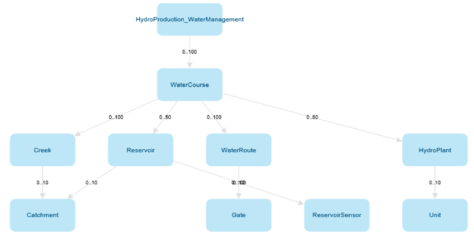

# Modelling

Mesh is a data management system based on object modelling.
Real world objects are represented in Mesh using the following concepts:

* models and model definitions
* objects and object definitions
* attributes and attribute definitions

Model definition contains one or more object definitions. Each object
definition contains one or more attribute definitions. The definitions
serve as *blueprints* and can be instantiated. Instances of the definitions are
just called: models, objects and attributes.

For example we could have a model definition called *EnergySystem* that has
object definition called *PowerPlant* that has two attribute definitions:

* *NumberOfWindTurbines* of integer type
* *PowerProduction* time series

Such definitions could be instantiated and so we could have: model called
*MyEnergySystem* that has three objects:

* *PowerPlantA* with *NumberOfWindTurbines* = 5
* *PowerPlantB* with *NumberOfWindTurbines* = 10
* *PowerPlantC* with *NumberOfWindTurbines* = 3


## Model definition

The Mesh model definition is designed to represent the structure of customer's
infrastructure and assets. This can be a hydropower production system with
water courses, creeks, reservoirs, water routes, gates, sensors, hydro plants
and so on. The Mesh model definition contains
[object definitions](#object-definition), [attribute types](#attribute-type)
and [attribute definitions](#attribute-definition) of different types.

Additionally, model definition contains [namespaces](#namespace) that are used
for grouping and filtering purposes. The model definition is also a top-level
namespace.

Each asset type is represented by an [object definition](#object-definition).



### Object definition

Contains [attribute definitions](#attribute-definition) of different types.
Object definition could be compared to a C++ class.

For example: an object definition could represent a reservoir. It can have
an attribute definition that represents current water level in a reservoir and
an ownership relation attribute definition that represents how water is flowing
to another object like hydro plant.

### Attribute definition

Attribute definition may be singular or an array of one of the following types:

* Self-contained simple type: string, boolean, int, double or UTC timestamp.
* Time series attribute, it can be a calculation or a reference to a physical
  time series or virtual time series.
* [XY-set](./xy-sets.md)
* [Rating curve](./rating-curves.md)
* Ownership or link relation to an object definition. Refer to [attributes](#attribute) and [relations](./relations.md).

Each attribute definition has:

* ID
* name
* description
* value type, e.g.: double attribute or time series attribute
* minimum and maximum cardinality, useful for definitions of an array type
  (e.g. array of boolean), for singular definitions they are always set to 1

Additionally specific attribute definitions may have additional fields like
default value, accepted value ranges, etc. E.g.:

* time series attribute definition has *template expression*
* ownership relation attribute definition has *target object type name*.

Changing the name of an attribute definition will also change the names of
all already existing attributes in the model to the new value.

Attribute definition could be compared to a C++ class member.

### Attribute type

Used for creating *re-usable* [attribute definitions](#attribute-definition).
Once defined could be used by different [object definitions](#object-definition)
for creating an attribute definition based on it.

Every attribute definition that is based on an attribute type will inherit
name, description and unit of measurement (if applicable) of that attribute
type. For enumeration attribute types the definitions will also inherit default
value if not provided explicitly when creating the attribute definition.

Updates of all above mentioned properties (name, description and unit of
measurement) can be done on attribute definition level. In such case the
attribute type and attribute definition may have different property values.
However, there is a special way of handling changes to name and unit of
measurement done on attribute type level. Updating an attribute type name or
unit of measurement will update also names and unit of measurements in all
attribute definitions that were created based on the given attribute type.
Other properties like description will change just the property on the
attribute type level. See examples below:


### Namespace

Used for grouping and filtering purposes in a [model definition](#model-definition).
You can compare it to a C++ namespace.

Namespace may contain:

  * object definitions
  * attribute types
  * other (nested) namespaces

### Template calculation definition

Defines calculation expression that could be used by [time series attributes](#attribute).

### Tags

Special enumeration values that can be attached to attribute types and object
definitions. Similar to namespaces they are used for grouping and filtering
purposes.

## Model

Based on the Mesh [model definition](#model-definition), customers can build
a model of their infrastructure by creating instances matching their specific
assets. For example water courses named 'WaterCourse1', 'WaterCourse2',
reservoirs named 'Reservoir1', 'Reservoir2' and so on. The resulting
model is a tree where all the nodes are Mesh objects from the Mesh model
that represent customer's physical assets. The root (top-level) object, is
called model. It is the same as other regular objects, except it does not have
an owner.

Model is an instance of [model definition](#model-definition). There can be
multiple models based on the same model definition.

### Object

Mesh object contains [attributes](#attribute). Object is an instance of an
[object definition](#object-definition).

Objects are identified by IDs or paths, refer to
[objects and attributes paths](#objects-and-attributes-paths)
for more information.

### Attribute

Attribute is an instance of an [attribute definition](#attribute-definition).
Attribute contains a **definition** (inherited from attribute definition) and
possibly a **value** of some type.

There are the following types of attributes:

* **Simple attributes** - all of them have value(s) (defined on attribute level) and
  default value (defined on the attribute definition level). They are
  aggregating the following types:

    - Double attribute - additionally it has minimum value, maximum value and
    unit of measurement (defined on the attribute definition level).

        Definition value types are `DoubleAttributeDefinition` for singular value
        or `DoubleArrayAttributeDefinition` for collection of values.

    - Integer attribute - additionally it has minimum value, maximum value and
    unit of measurement (defined on the attribute definition level).

        Definition value types are `Int64AttributeDefinition` for singular value
        or `Int64ArrayAttributeDefinition` for collection of values.

    - Boolean attribute - definition value types are `BooleanAttributeDefinition`
    for singular value or `BooleanArrayAttributeDefinition` for collection of
    values.

    - String attribute - definition value types are `StringAttributeDefinition`
    for singular value or `StringArrayAttributeDefinition` for collection of
    values.

    - UTC time attribute - additionally it has minimum value and maximum values
    (defined on the attribute definition level).

        The default, minimum and maximum value for this attribute is a string,
        where you can use expressions like: `UTC20220510072415`.
    
        Definition value types are `UtcDateTimeAttributeDefinition` for singular
        value or `UtcDateTimeArrayAttributeDefinition` for collection of values.

* **Time series attributes** - they can be a:

    - reference to a physical time series: it has actual data (timestamps,
    values and flags) and meta data (e.g.: curve type, resolution, etc.).

    - reference to a virtual time series: it has defined an expression to
    calculate time series data (similar to calculation time series).

    - calculation time series: it has defined an expression to calculate
    time series data. The calculation expression can be defined on the
    attribute definition level (then it is a *template expression*) or
    overwritten for the given attribute in the model (then it stored as
    *local expression*).

    Definition value types are `TimeseriesAttributeDefinition` for singular value
    or `TimeseriesCollectionAttributeDefinition` for collection of values.

* [**XY-set attributes**](./xy-sets.md)

* [**Rating curve attributes**](./rating-curves.md)

* **Ownership relation attributes** - represent relations where one object owns
  another object. The owned object's owner is always an ownership relation
  attribute that belongs to some other object.
  There are two types of ownership relation attributes:

    - one-to-one
    - one-to-many

    When creating a new object the owner must be an ownership relation attribute
    of one-to-many type. Ownership relation attribute has defined *target object
    type name* (on the attribute definition level) that shows what object value
    type is accepted to be added as child.

    Definition value types are `ElementAttributeDefinition` for singular value or
    `ElementCollectionAttributeDefinition` for collection of values.

    Refer to [relations](./relations.md) for more information.

* **Link relation attributes** - represent relations where one object may point
  to another object, but does not own it.
  There are two types of link relation attributes:

    - one-to-one
    - one-to-many

    Definition value types are `ReferenceAttributeDefinition` for singular value
    or `ReferenceCollectionAttributeDefinition` for collection of values.

    Refer to [relations](./relations.md) for more information.

* **Versioned link relation attributes** - extension of **link relation
  attributes**, where the target object can change over time.
  It consists of a list of pairs:

    - Target object ID.
    - Timestamp which indicates start of the period where the target object is
      active (linked to), the target object is active until the next target
      object in the list, if any, becomes active.

    There are two types of versioned link relation attributes:

      - one-to-one
      - one-to-many

    Definition value types are `ReferenceSeriesAttributeDefinition` for singular
    value or `ReferenceSeriesCollectionAttributeDefinition` for collection of
    values.

    Refer to [relations](./relations.md) for more information.

## Resource
  * Resource - Container storing data (e.g.: time series), used by [model](#model).
  * Physical time series - Time series data (timestamps, values and flags) and meta data (e.g.: curve type, resolution, etc.).
  * Virtual time series - Has defined an expression to calculate time series data (similar to calculation time series) but is stored in resources.
  * Catalog - Used for grouping and filtering purposes. Catalog typically contains physical time series, virtual time series or other catalogs. Similar to [namespaces](#namespace) in [model definition](#model-definition).

## Extended metadata

Extended metadata is an additional and optional information that can be set on:

- Namespaces and model definition (which is also a namespace)
- Attribute definitions
- Object definitions

It is a list of key-value pairs: category name and a JSON object.
Maximum size of the JSON object serialized to a string is 4000 characters.

If a given attribute definition, object definition or namespace has more
than one extended metadata, then the category names must be unique.

For example, an object definition may have 2 extended metadata entries:
* Category name `MyCategory1` with associated JSON object:
```json
{
    "Labels" : ["Label A","Label B"],
    "Something" : {"MaxValue":100}
}
```

* Category name `MyCategory2` with associated JSON object:
```json
{
    "Active": true
}
```

## Objects and attributes paths

Objects and attributes are identified by IDs or paths. Path is a string
uniquely identifying an object in the model and contains all ancestors of
a given object and optionally their ownership relation attributes.

For example the path for some reservoir could be:
```
  Model/Mesh/MyArea/MyHydroProduction/MyWaterCourse/MyReservoir
```

This is a path where only objects are provided. A path where also ownership
relation attributes, that connect those objects, are provided is called full
name. For the same reservoir the full name path is:
```
  Model/Mesh.To_Areas/MyArea.To_HydroProduction/MyHydroProduction.To_WaterCourses/MyWaterCourse.To_Reservoirs/MyReservoir
```

As you can see the attributes are provided after objects and a *dot* "."
character. For example full name path for an attribute of the
*MyReservoir* reservoir is:
```
  Model/Mesh.To_Areas/MyArea.To_HydroProduction/MyHydroProduction.To_WaterCourses/MyWaterCourse.To_Reservoirs/MyReservoir.MaxVolume
```

Every path in Mesh model starts with `Model/` prefix.

Mesh gRPC API returns always full names as paths when reading
objects or attributes. The path containing attributes (full name path) is
guaranteed to be unique, whereas depending on the model the path without
attributes may be ambiguous.

## Mapping

We strongly advise to use the above definitions, but some of them were already known under different names:

* Model definition - object model, meta model, repository (in Mesh Explorer)
* Object definition - element type, object type (in Mesh Configurator)
* Model - physical model
* Object - physical object
* Attribute - property
* Versioned XY set - `XYZSeries`
