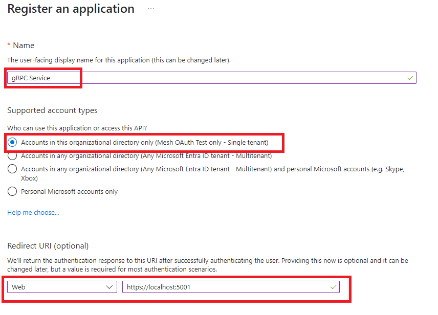
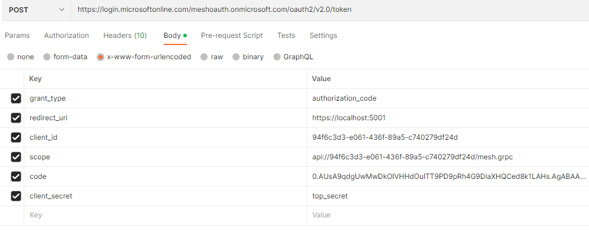
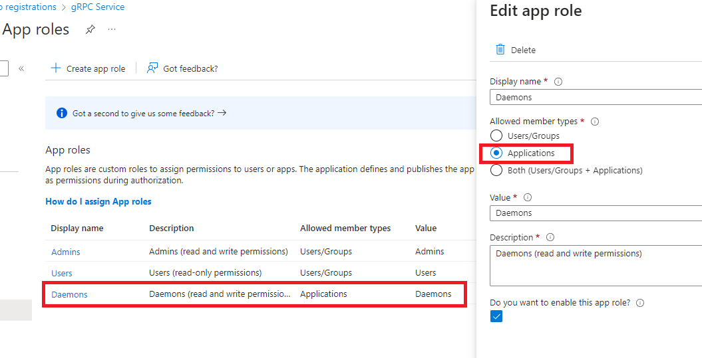
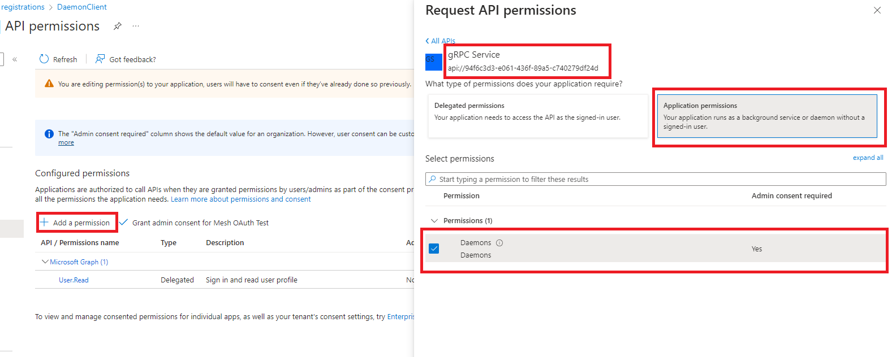
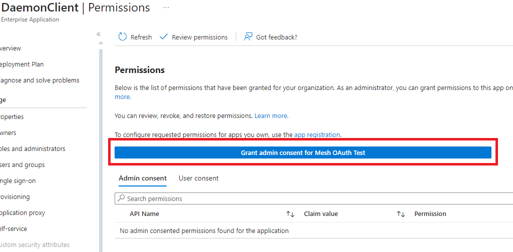

# Configuration

For functionality description and configuration please refer to:
[Mesh service installation guide](../installation/MeshServiceInstallationGuide.md#mesh-grpc-server).

# Testing

## OAuth 2.0

For Microsoft Entra ID environment you can follow the steps below:

- For the protected API (i.e.: Mesh gRPC server) create an application
  registration:

  


### Authorization code flow

- Expose API of the created application and add a scope:

  

- Create client secret and save its value:

  

- Create app roles for the users/groups:

  

- Assign app roles to the users/groups:

  

Now we want to get an access token. First we need to call `authorize` endpoint
and get authorization code. Open internet browser, enter the following URL and
change the parameters according to your setup:

```
https://login.microsoftonline.com/YOUR_DOMAIN.onmicrosoft.com/oauth2/v2.0/authorize?response_type=code&client_id=YOUR_CLIENT_ID&redirect_uri=REDIRECT_URI_FROM_STEP_1&scope=openid%20profile
```

In return we should get something like this:
```
https://localhost:5001/?code=0.AUsA9qdgUwMwDkOIVHHdOulTT9PD9pRh4G9DiaXHQCed8k1LAHs.AgABAAIAAAD--DLA3VO7QrddgJg7WevrAgDs_wUA9P9bchFZhU35cRjwyL4Ody0v5VVAPW5RhSdysOasDYmhU-QSjiZVIiL_Ma8fxNlGdoZiM0bi_fQ0alKr8qEB-ZhezENOme3DdYd11Q_1_6gVqtgUV_yqRO8oHvh7mma14QD_r41ClgcZhxYvTLlDyAddqqL4Qk92-7u2kaMYfu9RlinZ9DoCI29-GGjTAgxUePlQgVBfMmquKaQG2sBs3tbEhi3prwZrzI-vqbRel0mur7ssn2-2YKREjmL4d9cc04V0mYoy612SEJm3UgZMjvby5A9M28pYFUdlBNSOoNl8tYku7jRVROYGESJL5OxPRYEA-yecPo2LtHUqsnp6X9CEV4s8z7G8rMmQlYZibzuppr5WJ_AWj_d_jaZrYJI2oJFO3KrkoRGvK-v71l_6bdVxesMc2m5QQFInHMF6_P_9NqxqevKq1nub98ms8DqgfIcUatYLxcVTIBKFIDrSLcYYDLMkTvuIpTmTBX0dSbdTcYL8tNCcEh197bUPZHIu8jHaL-eV8wQm1TprzsbJun6y0e1C5ExYe3IfUFbl6uomjcb6VDqZV4l3RSiFGJxe9af7CPzbWSqnx7Z0D4c3H1BIxul8j_oL1OgSL1wIJlLnx88XQgHz9p0v0k9dCGSUK-95Mjq8BiOG7URWJx_Q6SozZvsgm0TT7GBv5-NTigRHJL7L6iAOZTl4vhFl9evex7SX5N3Y_5w_N1h2kvhPA7ufRlJaF77N6t2hvxsiJ85Q8Yby76zN2f3fxhvUBze1YQT25wGTE8znP79dVTll2EVNk--FYn7qTzc5P6aOzhlgvFHS6IsDg18yefI_S0_7jDDTVLopHPdpIqY&session_state=ba3502a4-903f-461c-bbdb-995e4d76ed62#
```

Copy the `code` parameter value. Now we need to make a `POST` request to the `token` endpoint.
For this I'm using Postman, but you can use also curl or other software.

  

```
  URL: https://login.microsoftonline.com/YOUR_DOMAIN.onmicrosoft.com/oauth2/v2.0/token
  grant_type: authorization_code
  redirect_uri: REDIRECT_URI_FROM_STEP_1
  client_id: YOUR_CLIENT_ID
  scope: YOUR_SCOPE_FROM_STEP_2
  code: CODE_GOT_FROM_TOKEN_ENDPOINT
  client_secret: YOUR_CLIENT_SECRET_FROM_STEP_3
```

You will get a response message with access token. You can check the access
token's content in e.g.: [jwt.io](https://jwt.io). The access token could now be
used to call e.g. Mesh gRPC server. For gRPC the token needs to be send in the
 `Authorization` header when making a call to the API, like:
```
Authorization: Bearer <token>
```


### Client credentials flow

- In the protected API application create app roles for the applications (daemons):

  
  
- For the daemon client application follow the steps below. Create new application
  registration, leave the `Redirect URI` empty:

  

- Create client secret and save its value.
- Request API permission for the app role created in step 1:

  

- Now we need to grant consent for the requested permission. Click on the
  `Enterprise applications` link:

  
  

- At the end we should see proper status in the API permission view:

  

Now we want to get an access token. We need to make a `POST` request to the `token` endpoint.
For this I'm using Postman, but you can use also curl or other software.
  
```
  URL: https://login.microsoftonline.com/YOUR_DOMAIN.onmicrosoft.com/oauth2/v2.0/token
  grant_type: client_credentials
  client_id: YOUR_CLIENT_ID (the deamon app ID)
  scope: PROTECTED_API_APPLICATION_ID_URI + '/.default' (e.g.: api://94f6c3d3-e061-436f-89a5-c740279df24d/.default)
  client_secret: YOUR_CLIENT_SECRET_FROM_STEP_3
```

You will get a response message with access token. You can check the access
token's content in e.g.: [jwt.io](https://jwt.io). The access token could now be
used to call e.g. Mesh gRPC server. For gRPC the token needs to be send in the
 `Authorization` header when making a call to the API, like:
```
Authorization: Bearer <token>
```

### Python SDK

To test the access token you can also use one of the Python SDK's
[example scripts](https://github.com/Volue-Public/energy-mesh-python/blob/master/src/volue/mesh/examples/connect_using_external_access_token.py).

You can also extend the example script with e.g.: MSAL library to acquire the
access token in the background.

See documentation on how to connect and authorize using Mesh Python SDK to
a Mesh server that is using OAuth authorization:
https://volue-public.github.io/energy-mesh-python/external_auth.html


## Kerberos

### Python SDK

See documentation on how to connect and authorize using Mesh Python SDK to
a Mesh server that is using Kerberos authentication:
https://volue-public.github.io/energy-mesh-python/kerberos.html
